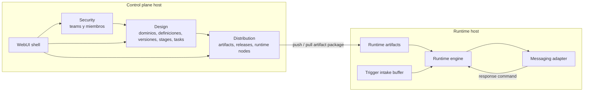
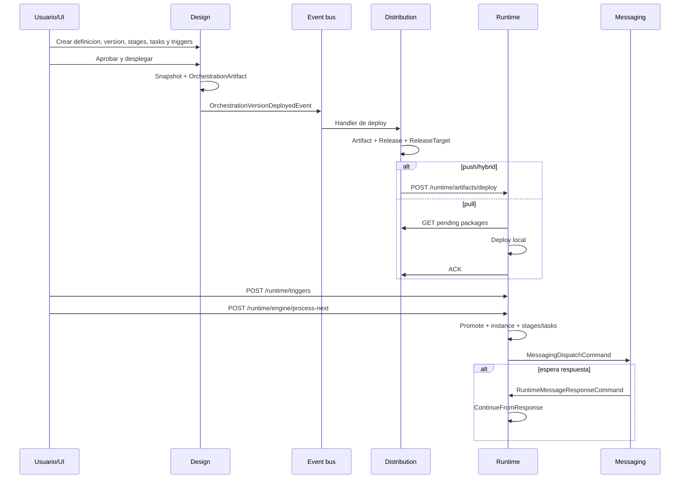
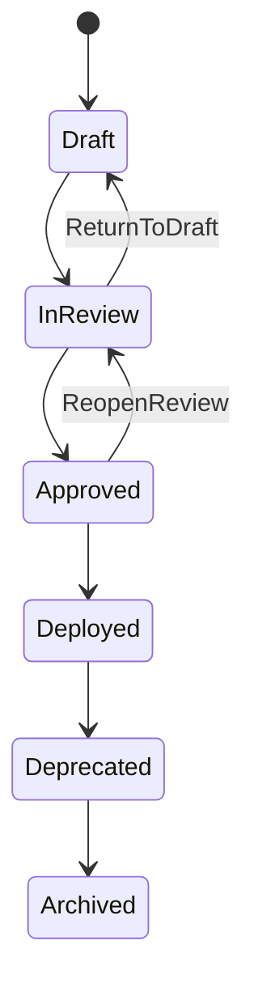

# Krackend.Sagas.Orchestrations - Manual end-to-end

Este documento explica Orchestrator completo despues de la migracion a
`Krackend.Sagas.Orchestrations.*`: arquitectura, modelos, pasos de negocio,
delivery, runtime, endpoints, storage, riesgos y diagnostico. La idea es que se
pueda seguir el sistema desde que se crea una definicion hasta que una instancia
termina en runtime.

Regla base: el core vive en librerias NuGet; los hosts solo referencian,
configuran y contienen migraciones.

## Arquitectura

Orchestrator tiene dos planos.

- Control plane: Security, Design, Distribution y WebUI. Administra equipos,
  definiciones, versiones, artifacts y runtime nodes.
- Runtime plane: artifacts activos, intake de triggers, engine, estado de
  ejecucion y mensajeria.



## Paquetes

| Paquete | Responsabilidad |
| --- | --- |
| `Krackend.Sagas.Orchestrations.Abstractions` | Primitives, artifact models, runtime entities, repositorios runtime e intake buffer. |
| `Krackend.Sagas.Orchestrations` | Runtime core: ambiente, buffer in-memory, resolver de artifact, promoter, engine, dispatcher de mensajeria. |
| `Krackend.Sagas.Orchestrations.Contracts` | Eventos de integracion entre Security, Design y Distribution. |
| `Krackend.Sagas.Orchestrations.ControlPlane.Bootstrap` | Registro one-call del control plane completo. |
| `Krackend.Sagas.Orchestrations.Design` | Modelo de autoria de orquestaciones. |
| `Krackend.Sagas.Orchestrations.Design.Interaction` | Commands, queries, services, validators, mappers, lifecycle policy y artifact snapshot. |
| `Krackend.Sagas.Orchestrations.Design.Storage.SqlServer` | Repositorios EF Core SQL Server de Design. |
| `Krackend.Sagas.Orchestrations.Design.WebUI` | UI Razor de autoria. |
| `Krackend.Sagas.Orchestrations.Distribution` | Environments, runtime nodes, artifacts, releases, targets, attempts y policies. |
| `Krackend.Sagas.Orchestrations.Distribution.Interaction` | Servicios de distribucion, artifact builders, handlers lifecycle y endpoints push/pull. |
| `Krackend.Sagas.Orchestrations.Distribution.Storage.SqlServer` | Repositorios EF Core SQL Server de Distribution. |
| `Krackend.Sagas.Orchestrations.Distribution.WebUI` | UI Razor de distribucion. |
| `Krackend.Sagas.Orchestrations.EntityFrameworkCore.SqlServer` | Repositorios EF Core SQL Server de runtime. |
| `Krackend.Sagas.Orchestrations.Messaging.Abstractions` | Contratos broker-neutral y metadata de orquestacion. |
| `Krackend.Sagas.Orchestrations.Messaging.Pigeon` | Adapter Pigeon opcional. |
| `Krackend.Sagas.Orchestrations.Runtime.WebUI` | UI Razor de runtime artifacts. |
| `Krackend.Sagas.Orchestrations.Security` | Modelo de equipos y miembros. |
| `Krackend.Sagas.Orchestrations.Security.Interaction` | Servicios, commands, queries y validadores de equipos. |
| `Krackend.Sagas.Orchestrations.Security.Storage.SqlServer` | Repositorios EF Core SQL Server de Security. |
| `Krackend.Sagas.Orchestrations.Security.WebUI` | UI Razor de equipos. |
| `Krackend.Sagas.Orchestrations.Web` | Minimal APIs runtime: artifacts, pull, triggers y engine. |
| `Krackend.Sagas.Orchestrations.WebUI.Shell` | Navegacion y shell compartido. |

## Flujo completo de inicio a fin

1. El host de control plane registra `AddOrchestratorControlPlane`.
2. El host aplica sus migraciones propias para Security, Design y Distribution.
3. Security crea o actualiza un `Team`.
4. Security publica eventos de lifecycle de equipos.
5. Design consume esos eventos y mantiene un `TeamProjection`.
6. Design crea un `Domain`.
7. Design crea una `OrchestrationDefinition` con `Key` estable.
8. Design crea una `OrchestrationVersion` en `Draft`.
9. Se agregan triggers, variables, stages, tasks, parallel groups y branch rules.
10. La version pasa por `Draft -> InReview -> Approved -> Deployed`.
11. Al desplegar, Design arma un snapshot completo de la version.
12. Design serializa ese snapshot como `OrchestrationArtifact`.
13. Design publica `OrchestrationVersionDeployedEvent`.
14. Distribution recibe el evento, construye `Artifact` y lo valida.
15. Distribution busca runtime nodes permitidos por policy.
16. Si no hay nodos permitidos, se guarda el artifact pero no se promueve.
17. Si hay nodos activos, Distribution crea `Release` y `ReleasePlanTarget`.
18. Por cada nodo crea `ReleaseTarget`.
19. Nodos `Push` o `Hybrid`: Distribution llama al runtime.
20. Nodos `Pull`: Distribution deja el target `AvailableForPull`.
21. Runtime recibe o jala el package.
22. Runtime valida environment, version semantica, checksum y payload JSON.
23. Runtime guarda `RuntimeOrchestrationArtifact`.
24. Si `ArtifactType` es `orchestration.deploy`, lo activa.
25. Runtime desactiva artifacts activos anteriores para la misma definition key.
26. Runtime sincroniza consumidores de mensajeria.
27. Llega un trigger a `/runtime/triggers`.
28. Runtime valida trigger key, environment, trigger type y JSON.
29. Runtime encola `TriggerIntakeBufferItem`.
30. `/runtime/engine/process-next` toma un item del buffer.
31. `TriggerPromoter` crea o reutiliza `TriggerIntake` por idempotencia.
32. `ArtifactResolver` busca el artifact activo.
33. `TriggerPromoter` crea `OrchestrationInstance`.
34. `RuntimeEngine` parsea el artifact activo.
35. El engine ejecuta stages y tasks habilitadas en orden.
36. Para tasks messaging crea attempt, dispatch y comando de mensajeria.
37. Si la task espera callback, la instancia queda `Waiting`.
38. Cuando llega respuesta, `ContinueFromResponse` completa la task y continua.
39. Si todo termina, la instancia queda `Completed`.
40. Si algo falla, stage e instancia quedan `Failed`.
41. Cada paso relevante queda en `ExecutionTransition`.



## Modelo Design

Design es la fuente de verdad de autoria. Describe que se quiere ejecutar; no
guarda ejecuciones runtime.

### Domain

| Campo | Descripcion |
| --- | --- |
| `Id` | ULID fuerte. |
| `Key` | Clave estable. |
| `DisplayName` | Nombre visible. |
| `Description` | Contexto funcional. |
| `IsActive` | Habilitacion logica. |
| `CreatedOnUtc`, `UpdatedOnUtc` | Auditoria. |

### OrchestrationDefinition

| Campo | Descripcion |
| --- | --- |
| `Id` | Identificador. |
| `Key` | Clave usada por artifacts y runtime. |
| `Name` | Nombre visible. |
| `Description` | Descripcion. |
| `Domain`, `DomainId`, `DomainDisplayName` | Dominio asociado y snapshot. |
| `OwnerTeam`, `OwnerTeamId`, `OwnerTeamDisplayName` | Equipo owner proyectado desde Security. |
| `Tags` | Clasificacion. |
| `IsActive` | Habilitacion logica. |
| `CreatedOnUtc`, `CreatedBy`, `UpdatedOnUtc`, `UpdatedBy` | Auditoria. |

Eventos: created, updated, deactivated. Distribution los usa para mantener
`OrchestrationProjection`.

### OrchestrationVersion

| Campo | Descripcion |
| --- | --- |
| `Id` | Identificador de version. |
| `OrchestrationDefinitionId` | Definicion padre. |
| `Version` | `SemanticVersion` major.minor.patch. |
| `Status` | `Draft`, `InReview`, `Approved`, `Deployed`, `Deprecated`, `Archived`. |
| `VersionLabel` | Alias legible. |
| `Description` | Descripcion de la version. |
| `Checksum` | Huella de artifact. |
| `TriggerBindings` | Triggers declarados. |
| `StageDefinitions` | Stages declaradas. |
| `VariableDefinitions` | Variables declaradas. |
| `Notes` | Notas. |
| `CreatedOnUtc`, `CreatedBy`, `ApprovedOnUtc`, `ApprovedBy`, `UpdatedOnUtc`, `UpdatedBy` | Auditoria. |



### TriggerBinding

| Campo | Descripcion |
| --- | --- |
| `Id` | Identificador. |
| `OrchestrationVersionId` | Version propietaria. |
| `Key` | Clave del trigger. Debe alinearse con el `TriggerKey` runtime. |
| `TriggerType` | `Event`, `Http`, `Scheduled`, `Manual`, `Custom`. |
| `TriggerChannel` | Canal concreto. Hoy existe `EventTriggerChannel`. |
| `IsEnabled` | Habilitacion. |
| `Description` | Contexto. |

`EventTriggerChannel` contiene `SchemaBinding`, `Topic` y `Version`.

### VariableDefinition

| Campo | Descripcion |
| --- | --- |
| `Id` | Identificador. |
| `OrchestrationVersionId` | Version propietaria. |
| `Key` | Nombre estable. |
| `DisplayName` | Nombre visible. |
| `Description` | Contexto. |
| `Scope` | `Definition`, `Environment`, `Instance`, `System`. |
| `ValueType` | `String`, `Number`, `Decimal`, `Boolean`, `Json`, `DateTimeUtc`, `TimeSpan`, `Reference`, `SecretReference`. |
| `DefaultValue` | Valor default serializado. |
| `IsRequired` | Obligatoria o no. |
| `IsSensitive` | Manejo sensible. |

### StageDefinition

| Campo | Descripcion |
| --- | --- |
| `Id` | Identificador. |
| `OrchestrationVersionId` | Version propietaria. |
| `Key` | Clave estable. |
| `Name` | Nombre visible. |
| `Description` | Contexto. |
| `Order` | Orden de ejecucion. |
| `ExecutionCondition` | Condicion declarada. |
| `TaskDefinitions` | Tasks ordenadas. |
| `ParallelGroups` | Grupos paralelos declarados. |
| `BranchRules` | Reglas de navegacion declaradas. |

### TaskDefinition

| Campo | Descripcion |
| --- | --- |
| `Id` | Identificador. |
| `StageDefinitionId` | Stage propietaria. |
| `Key` | Clave estable. |
| `Name` | Nombre visible. |
| `Order` | Orden dentro de stage. |
| `Notes` | Notas. |
| `Kind` | `Messaging`, `Http`, `Plugin`, `HumanApproval`. |
| `ExecutionMode` | `Sequential` o `Parallel`. |
| `ParallelGroupId` | Grupo paralelo opcional. |
| `ExecutionCondition` | Condicion declarada. |
| `Transformation` | Transformacion declarada. |
| `Configuration` | Configuracion especifica. |
| `RetryPolicy` | Reintentos. |
| `TimeoutPolicy` | Timeouts. |
| `OnErrorPolicy` | `Continue`, `Stop`, `StopAndCompensate`. |
| `CompensationDefinition` | Compensacion. |
| `DispatchType` | `FireAndForget`, `FireAndWait`, `FireAndWaitCallback`. |
| `IsEnabled` | Solo habilitadas entran al parser runtime. |

Configuraciones:

| Tipo | Campos |
| --- | --- |
| `MessagingTaskConfiguration` | `Topic`, `Version`, `SchemaBinding`. Es la configuracion ejecutada por el engine actual. |
| `HttpTaskConfiguration` | `SchemaBinding`, `BaseUrlVariableRef`, `RelativePath`, `Method`, `HeadersTemplate`, `QueryTemplate`, `ExpectedStatusCodes`, `AllowSyncResponse`. |
| `HumanApprovalTaskConfiguration` | Marcador de aprobacion humana. |
| `PluginTaskConfiguration` | `PluginId`. |

### Politicas, ramas y paralelismo

| Modelo | Campos |
| --- | --- |
| `ExecutionCondition` | `Engine`, `Configuration`. |
| `DslConditionConfiguration` | `Expression`. |
| `TransformationDefinition` | `Engine`, `Configuration`. |
| `DslTransformationConfiguration` | Marcador actual. |
| `RetryPolicy` | `MaxRetries`, `StrategyType`, `Strategy`, `RetryableErrorCodes`, `StopOnNonRetryableError`. |
| `FixedRetryStrategy` | `Delay`. |
| `TimeoutPolicy` | `Timeout`, `TimeoutBehavior`, `TimeoutBehaviorPolicy`. |
| `FailTimeoutBehaviorPolicy` | `ErrorCode`. |
| `WaitTimeoutBehaviorPolicy` | `OrchestrationAction`, `WaitingTime`. |
| `ReconcileTimeoutBehaviorPolicy` | `OrchestrationAction`, `RetryPolicy`. |
| `CompensationDefinition` | `CompensationTaskKind`, `Transformation`, `ExecutionCondition`, `Configuration`, `RetryPolicy`, `TimeoutPolicy`, `DispatchType`. |
| `BranchRuleDefinition` | `FromType`, `FromId`, `Condition`, `NavigateToType`, `NavigateToId`. |
| `ParallelGroupDefinition` | `StageDefinitionId`, `Name`, `JoinPolicy`, `MaxParallelAgents`. |

Nota importante: el artifact ya transporta conditions, branches y parallel
groups, pero el runtime engine actual ejecuta linealmente stages/tasks
habilitadas en orden. Es una capacidad modelada, no totalmente ejecutada por el
engine Beta 1.

### TeamProjection

Projection ligera en Design de equipos de Security:
`Id`, `Key`, `DisplayName`, `IsActive`, `UpdatedAtUtc`.

## Modelo Security

### Team

`Id`, `Key`, `DisplayName`, `Description`, `IsActive`, `CreatedOnUtc`,
`UpdatedOnUtc`.

### TeamMember

`Id`, `TeamId`, `ExternalUserId`, `DisplayName`, `CreatedOnUtc`.

Operaciones principales: upsert team, activar/desactivar, listar, agregar
miembro, remover miembro y listar miembros.

## Modelo Distribution

Distribution decide donde y como se entrega una version.

### RuntimeEnvironment

`Id`, `Name`, `Code`, `Description`, `IsEnabled`, `CreatedAtUtc`,
`UpdatedAtUtc`. `Code` debe corresponder con el `EnvironmentKey` del runtime.

### RuntimeNode

| Campo | Descripcion |
| --- | --- |
| `Id` | Nodo runtime. |
| `Name`, `Code` | Nombre y clave. |
| `EnvironmentId`, `EnvironmentName` | Ambiente. |
| `DistributionMode` | `Push`, `Pull`, `Hybrid`. |
| `EndpointBaseUri` | Base URI para push. |
| `EndpointApiPath` | Ruta de deploy; default `runtime/artifacts/deploy`. |
| `AuthenticationMode` | `None`, `ClientCredentials`, `ApiKey`. |
| `ClientId`, `SecretReference`, `ApiKeyReference` | Referencias de autenticacion. |
| `Status` | `Active`, `Disabled`, `Revoked`. |
| `IsEnabled` | Habilitacion. |
| `Description` | Contexto. |
| `RegisteredAtUtc`, `LastUpdatedAtUtc` | Auditoria. |
| `Capabilities` | Pares `Name`/`Value`. |

### OrchestrationProjection y policy

`OrchestrationProjection`: `Id`, `Key`, `Name`, `IsActive`,
`CreatedAtUtc`, `UpdatedAtUtc`.

`OrchestrationAllowedRuntimeNode`: `OrchestrationDefinitionId`,
`RuntimeNodeId`, `CreatedAtUtc`, `CreatedBy`. Sin nodos permitidos no hay
promocion automatica a runtime.

### Artifact

`Id`, `OrchestrationDefinitionId`, `OrchestrationVersionId`,
`OrchestrationDisplayName`, `VersionLabel`, `VersionNumber`, `ArtifactType`,
`SchemaVersion`, `Payload`, `Metadata`, `SourceEvent`, `SourceVersion`,
`Checksum`, `IsPublished`, `CreatedAtUtc`, `PublishedAtUtc`.

`ArtifactType = orchestration.deploy` es el que activa configuracion runtime.

### Release y targets

`Release`: `Id`, `ArtifactId`, `OrchestrationDefinitionId`, `RequestedBy`,
`Strategy`, `Status`, `CreatedAtUtc`, `CompletedAtUtc`.

`ReleasePlanTarget`: `Id`, `ReleaseId`, `RuntimeNodeId`, `Status`,
`CreatedAtUtc`, `CompletedAtUtc`, `Notes`.

`ReleaseTarget`: `Id`, `RuntimeNodeId`, `ArtifactId`, `ReleaseId`,
`RolloutGroup`, `Status`, `ActivationStatus`, `AssignedAtUtc`,
`AvailableAtUtc`, `DeliveredAtUtc`, `AcknowledgedAtUtc`, `ActivatedAtUtc`,
`FailedAtUtc`, `FailureReason`, `RuntimeVersionApplied`, `CorrelationId`.

`ReleaseAttempt`: `Id`, `ReleaseTargetId`, `Action`, `InitiatedBy`,
`StartedAtUtc`, `FinishedAtUtc`, `Succeeded`, `ErrorCode`, `ErrorMessage`,
`ExternalReference`.

Estados:

- `ReleaseStatus`: `Draft`, `InProgress`, `Completed`, `Failed`, `Cancelled`.
- `ReleaseTargetStatus`: `Pending`, `AvailableForPull`, `PushScheduled`,
  `InProgress`, `Delivered`, `Acknowledged`, `Activated`, `Failed`,
  `Cancelled`.
- `ActivationStatus`: `NotActivated`, `Activating`, `Activated`,
  `ActivationFailed`.

## Modelo Runtime

### RuntimeOrchestrationArtifact

`Id`, `EnvironmentKey`, `OrchestrationDefinitionKey`, `ArtifactType`,
`SourceOrchestrationVersionId`, `Version`, `ArtifactChecksum`,
`ArtifactPayload`, `IsActive`, `LoadedToCache`, `DeployedOnUtc`,
`ActivatedOnUtc`, `RetiredOnUtc`, `SupersededByArtifactId`, `Notes`.

### TriggerIntakeBufferItem y TriggerIntake

`TriggerIntakeBufferItem`: `BufferItemId`, `TriggerType`, `TriggerKey`,
`EnvironmentKey`, `CorrelationId`, `IdempotencyKey`, `SourceMessageId`,
`PayloadJson`, `ReceivedOnUtc`.

`TriggerIntake`: `Id`, `TriggerType`, `TriggerKey`, `EnvironmentKey`,
`CorrelationId`, `IdempotencyKey`, `SourceMessageId`, `SourceRequestId`,
`RawPayload`, `NormalizedPayload`, `Status`, `PersistenceLevel`,
`BufferLocation`, `ResolvedArtifactId`, `PromotedInstanceId`, `ReceivedOnUtc`,
`PromotedOnUtc`, `ExpiresOnUtc`, `RejectionReason`, `FailureReason`.

Estados: `Received`, `Buffered`, `PersistedPrimary`, `PersistedSecondary`,
`PromotedToRuntime`, `Rejected`, `Expired`, `Failed`.

`TriggerIntakeAttempt`: `Id`, `TriggerIntakeId`, `AttemptNumber`,
`ActionType`, `Outcome`, fechas, `ErrorCode`, `ErrorMessage`, `Metadata`.

### OrchestrationInstance

`Id`, `EnvironmentKey`, `OrchestrationDefinitionKey`,
`RuntimeOrchestrationArtifactId`, `TriggerIntakeId`, `CorrelationId`,
`ExecutionKey`, `Status`, `CurrentStageKey`, `CurrentTaskKey`,
`CurrentParallelGroupKey`, `StartedOnUtc`, `LastUpdatedOnUtc`,
`WaitingSinceUtc`, `CompletedOnUtc`, `FailedOnUtc`, `StoppedOnUtc`,
`CompensationStartedOnUtc`, `CompensatedOnUtc`, `FinalOutcome`,
`ErrorSummary`, `RetryCount`, `ActiveLeaseId`, `ActiveLeaseExpiresOnUtc`,
`SnapshotPayload`, `Metadata`.

Estados: `Created`, `Running`, `Waiting`, `Stopped`, `Compensating`,
`Compensated`, `Completed`, `CompletedWithErrors`, `Failed`.

### StageExecution

`Id`, `OrchestrationInstanceId`, `StageKey`, `Order`, `Status`,
`WasSkipped`, `SkipReason`, `ExecutionConditionResult`, `StartedOnUtc`,
`CompletedOnUtc`, `FailedOnUtc`, `ErrorSummary`, `ParallelGroupCount`,
`Metadata`.

Estados: `Pending`, `Running`, `Skipped`, `Completed`,
`CompletedWithErrors`, `Failed`.

### TaskExecution, Attempt y Dispatch

`TaskExecution`: `Id`, `OrchestrationInstanceId`, `StageExecutionId`,
`TaskKey`, `TaskKind`, `ExecutionMode`, `ParallelGroupId`, `Status`,
`WasSkipped`, `SkipReason`, `ExecutionConditionResult`, `OnErrorPolicy`,
`AwaitResponse`, `StartedOnUtc`, `WaitingSinceUtc`, `CompletedOnUtc`,
`FailedOnUtc`, `TimedOutOnUtc`, `LastAttemptNumber`,
`OutputVariablesPayload`, `CorrelationId`, `Metadata`.

`TaskExecutionAttempt`: `Id`, `TaskExecutionId`, `AttemptNumber`, `Status`,
fechas, `RequestPayload`, `ResponsePayload`, `ErrorCode`, `ErrorMessage`,
`DispatchId`, `Metadata`.

`TaskDispatch`: `Id`, `TaskExecutionAttemptId`, `DispatchType`,
`Destination`, `RequestPayload`, `DispatchStatus`, `CommandId`,
`CorrelationId`, fechas, `FailureReason`, `Metadata`.

Estados task: `Pending`, `Running`, `WaitingResponse`, `Retrying`,
`Skipped`, `Completed`, `CompletedWithErrors`, `Failed`, `TimedOut`,
`Cancelled`, `Compensated`.

### ExecutionTransition

Timeline de auditoria: `Id`, `OrchestrationInstanceId`, `StageExecutionId`,
`TaskExecutionId`, `TaskExecutionAttemptId`, `TransitionType`, `FromStatus`,
`ToStatus`, `OccurredOnUtc`, `Message`, `Payload`, `ProducedBy`.

Transiciones actuales: `TriggerPromoted`, `InstanceStarted`, `StageStarted`,
`TaskStarted`, `TaskWaitingResponse`, `InstanceWaitingResponse`,
`TaskResponseReceived`, `TaskCompleted`, `StageCompleted`,
`InstanceCompleted`, `TaskFailed`, `StageFailed`, `InstanceFailed`.

### Variables y compensacion

`InstanceVariable`: `Id`, `OrchestrationInstanceId`, `Key`, `Scope`,
`ValueType`, `Value`, `IsSensitive`, `SourceType`, `SourceReference`,
`CreatedOnUtc`, `UpdatedOnUtc`, `LastUpdatedBy`.

`EnvironmentVariableValue`: `Id`, `EnvironmentKey`, `VariableKey`,
`ValueType`, `Value`, `IsSensitive`, `IsResolved`, `LastValidatedOnUtc`,
`CreatedOnUtc`, `UpdatedOnUtc`, `UpdatedBy`, `Notes`.

`CompensationExecution`: `Id`, `OrchestrationInstanceId`,
`SourceTaskExecutionId`, `CompensationTaskKey`, `Status`, fechas,
`RequestPayload`, `ResponsePayload`, `ErrorMessage`, `Metadata`.

## Artifact ejecutable

Design crea `OrchestrationArtifact` con definicion, version, checksum,
triggers, variables, stages, descripcion, label y notas. Cada stage contiene
tasks, parallel groups y branch rules. Cada task contiene kind, mode,
configuration, retry, timeout, error policy, compensation, dispatch type y
enabled.

El runtime parser extrae lo necesario para ejecutar Beta 1:

- artifact key
- artifact version
- stages ordenadas
- tasks habilitadas ordenadas
- task kind
- execution mode
- destination topic
- message version
- si debe esperar respuesta

Una task se considera messaging si `Kind` es `Messaging` o `0`. Las tasks no
messaging fallan en el engine actual con mensaje de no soportado en Beta 1.

## Endpoints

### Runtime

| Metodo | Ruta | Funcion |
| --- | --- | --- |
| `POST` | `/runtime/artifacts/deploy` | Recibe artifact package y lo materializa en runtime. |
| `GET` | `/runtime/artifacts/active/{orchestrationDefinitionKey}` | Obtiene artifact activo. |
| `POST` | `/runtime/artifacts/pull` | Jala artifacts pendientes desde Distribution. |
| `POST` | `/runtime/triggers` | Valida y encola trigger. |
| `POST` | `/runtime/engine/process-next` | Procesa un item. |
| `POST` | `/runtime/engine/process-all` | Procesa varios items; default 25, maximo interno 250. |

### Distribution

| Metodo | Ruta | Funcion |
| --- | --- | --- |
| `POST` | `/distribution/release-targets/{releaseTargetId}/push` | Fuerza push. |
| `GET` | `/distribution/runtime-nodes/{runtimeNodeId}/artifacts/pending` | Lista packages pendientes para pull. |
| `POST` | `/distribution/runtime-nodes/{runtimeNodeId}/artifacts/{releaseTargetId}/ack` | Confirma activacion pull. |

## Montaje de hosts

### Control plane

```csharp
builder.Services.AddRazorPages();

builder.Services.AddOrchestratorControlPlane(options =>
{
    options.AdminRootPath = "admin";
    options.ConfigureSqlServer = db =>
    {
        db.UseSqlServer(
            connectionString,
            sql => sql.MigrationsAssembly(typeof(Program).Assembly.GetName().Name));
    };
});

app.MapStaticAssets();
app.MapOrchestratorArtifactDeliveryEndpoints();
app.MapRazorPages().WithStaticAssets();
```

### Runtime

```csharp
builder.Services.AddKrackendSagasOrchestrationsRuntime(options =>
{
    options.EnvironmentKey = "local";
});

builder.Services.AddKrackendSagasOrchestrationsInMemoryIntakeBuffer(options =>
{
    options.Capacity = 10_000;
});

builder.Services.AddKrackendSagasOrchestrationsSqlServer(db =>
{
    db.UseSqlServer(
        builder.Configuration.GetConnectionString("Runtime"),
        sql => sql.MigrationsAssembly(typeof(Program).Assembly.GetName().Name));
});

builder.Services.AddKrackendSagasOrchestrationsEngine();
builder.Services.AddKrackendSagasOrchestrationsWeb(options =>
{
    options.DistributionBaseUri = builder.Configuration["Runtime:ArtifactPull:DistributionBaseUri"];
    options.RuntimeNodeId = builder.Configuration["Runtime:ArtifactPull:RuntimeNodeId"];
});

app.MapKrackendSagasOrchestrationsArtifactEndpoints();
app.MapKrackendSagasOrchestrationsEngineEndpoints();
```

## Migrations y storage

Las librerias no contienen migraciones. Los adapters SQL Server registran
`DbContext` y repositorios; la historia de migraciones vive en el host.

Samples actuales:

- `samples/Krackend.Sagas.Orchestrations.ControlPlaneHost.Sample/Migrations`
- `samples/Krackend.Sagas.Orchestrations.RuntimeHost.Sample/Migrations/RuntimeStorage`

## Detalle del engine runtime

### Enqueue

1. Recibe `RuntimeTriggerRequest`.
2. Valida request, `TriggerKey`, `EnvironmentKey`, `PayloadJson`.
3. Compara `EnvironmentKey` con `RuntimeEnvironmentDescriptor.EnvironmentKey`.
4. Parsea `TriggerType`; default `Event`.
5. Parsea JSON.
6. Crea `TriggerIntakeBufferItem`.
7. Encola y responde `Buffered` o `Rejected`.

### Promotion

1. `ProcessNext` obtiene lease del buffer.
2. Si no hay item responde `Idle`.
3. `TriggerPromoter` parsea JSON.
4. Si hay `IdempotencyKey`, busca intake existente.
5. Si ya hay `PromotedInstanceId`, reutiliza instancia.
6. Resuelve artifact activo por `EnvironmentKey` y `TriggerKey`.
7. Crea `TriggerIntake` en `PersistedPrimary`.
8. Crea `OrchestrationInstance` en `Created`.
9. Actualiza intake a `PromotedToRuntime`.
10. Escribe `TriggerPromoted`.

### Execute

1. Parsea `RuntimeOrchestrationArtifact.ArtifactPayload`.
2. Instancia pasa a `Running`.
3. Escribe `InstanceStarted`.
4. Recorre stages ordenadas.
5. Crea `StageExecution` en `Running`.
6. Recorre tasks habilitadas.
7. Crea `TaskExecution` en `Running`.
8. Si task no es messaging, falla.
9. Crea `TaskExecutionAttempt`.
10. Crea `TaskDispatch` en `Pending`.
11. Construye `MessagingDispatchCommand`.
12. `IMessagingCommandDispatcher` publica.
13. Si dispatch falla, marca dispatch/attempt/task failed.
14. Si no espera respuesta, marca completed y continua.
15. Si espera respuesta, instancia queda `Waiting`.
16. Al terminar stages, instancia queda `Completed`.

### ContinueFromResponse

1. Resuelve instancia, task, stage y attempt por dispatch id.
2. Completa attempt y task.
3. Limpia espera de instancia.
4. Actualiza `SnapshotPayload`.
5. Escribe `TaskResponseReceived` y `TaskCompleted`.
6. Continua con la siguiente task.
7. Completa stage e instancia si no queda trabajo.

## Messaging

`MessagingDispatchCommand` incluye `CommandId`, `CorrelationId`,
`Destination`, `MessageVersion`, `Payload`, `OrchestrationDefinitionKey`,
`OrchestrationVersion`, `OrchestrationInstanceId`, `TaskExecutionId`,
`DispatchId`, `EnvironmentKey`, `StageKey`, `TaskKey`, `CurrentStatus`,
`Attempt`, `StartedOnUtc`, `UpdatedOnUtc`.

`Messaging.Abstractions` permite conectar cualquier broker. `Messaging.Pigeon`
conecta la fachada con Pigeon y agrega metadata interceptors.

## Playbooks

### Crear y publicar una orquestacion

1. Crear/confirmar `Team`.
2. Confirmar `TeamProjection`.
3. Crear `Domain`.
4. Crear `OrchestrationDefinition`.
5. Crear `OrchestrationVersion`.
6. Crear `TriggerBinding` habilitado.
7. Crear variables requeridas.
8. Crear stages.
9. Crear tasks. Para runtime actual usar `MessagingTaskConfiguration`.
10. Pasar a review.
11. Aprobar.
12. Configurar allowed runtime nodes.
13. Desplegar.
14. Verificar artifact en Distribution.
15. Verificar release targets.
16. Verificar artifact activo en runtime.
17. Enviar trigger.
18. Procesar engine.
19. Revisar executions, dispatches y transitions.

### Push

1. Runtime node `Active` e `IsEnabled = true`.
2. `DistributionMode = Push` o `Hybrid`.
3. `EndpointBaseUri` configurado.
4. Policy permite la definicion en el node.
5. Deploy crea target `PushScheduled`.
6. Distribution llama runtime.
7. Si runtime acepta, target queda `Activated`.
8. Si falla y es `Hybrid`, queda `AvailableForPull`.
9. Si falla y es `Push`, queda `Failed`.

### Pull

1. Runtime node `Active` e `IsEnabled = true`.
2. `DistributionMode = Pull` o `Hybrid`.
3. Runtime configura `DistributionBaseUri` y `RuntimeNodeId`.
4. Distribution deja targets `AvailableForPull`.
5. Runtime llama `/runtime/artifacts/pull`.
6. Runtime despliega localmente.
7. Runtime manda ack.
8. Distribution marca target `Activated`.

## Riesgos y compatibilidad

| Riesgo | Impacto | Mitigacion |
| --- | --- | --- |
| Engine actual solo ejecuta tasks messaging. | Http/plugin/human approval viajan en artifact pero no ejecutan aun. | Documentado; agregar handlers por tipo antes de prometer soporte runtime completo. |
| Branches, conditions y parallel groups no gobiernan el flujo runtime actual. | El modelo expresa mas de lo que ejecuta Beta 1. | Tests de artifact y roadmap de engine avanzado. |
| Push depende de HTTP y configuracion de nodos. | Deploy puede fallar por red o ruta. | `Hybrid` cae a pull; attempts auditan fallas. |
| Migrations viven en hosts. | Consumidor administra upgrades de DB. | Samples y regla explicita. |
| Idempotencia depende de `IdempotencyKey`. | Triggers sin key pueden duplicar instancias. | Requerir key para productores criticos. |
| Nombres heredados `AddOrchestrator*`. | Puede confundir con nombres nuevos. | Mantener compatibilidad y documentar. |

El paquete viejo singular queda deprecado. El core migrado vive en
`Krackend.Sagas.Orchestrations.*`. Aun existen nombres publicos compatibles como
`AddOrchestratorControlPlane` y `MapOrchestratorArtifactDeliveryEndpoints`.

## Checklist de diagnostico

Si un trigger no ejecuta:

1. Confirmar artifact activo para la key.
2. Confirmar environment correcto.
3. Confirmar JSON valido.
4. Confirmar que `TriggerKey` corresponde al artifact activo.
5. Revisar enqueue: `Buffered` o `Rejected`.
6. Ejecutar `process-next`.
7. Si `Idle`, revisar buffer.
8. Si falla promotion, revisar artifact activo.
9. Si falla task, revisar `Kind`.
10. Revisar `TaskDispatch.FailureReason`.
11. Revisar `ExecutionTransition`.

Si un deploy no llega:

1. Version en `Deployed`.
2. Artifact creado en Distribution.
3. Allowed runtime nodes configurados.
4. Runtime node `Active` e `IsEnabled`.
5. Distribution mode correcto.
6. Para push, `EndpointBaseUri`.
7. Para pull, `DistributionBaseUri` y `RuntimeNodeId`.
8. Revisar `ReleaseTarget.Status`.
9. Revisar `ReleaseAttempt.ErrorMessage`.
10. Confirmar validaciones runtime de environment, version, checksum y payload.
